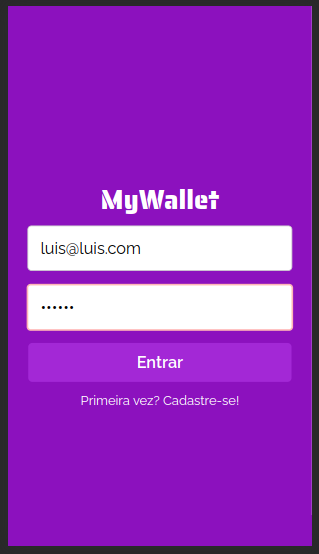

# My Wallet
https://github.com/LsBDev/My-Wallet-front/blob/main/LICENSE

O My Wallet é uma aplicação de carteira digital projetada para ajudar você a gerenciar suas finanças pessoais com facilidade. Com recursos de criação de cadastro, login e acompanhamento de entradas e saídas de gastos e receitas, o My Wallet oferece uma solução completa para o controle de suas finanças.


<a href="https://my-wallet-weld-zeta.vercel.app/"> Link para a Aplicação </a>
<p align="center">
  
  
  
  
</p>

## Funcionalidades Principais
 
### Cadastro e Login: 
Registre-se facilmente no My Wallet para começar a usar. Faça login de forma segura para acessar sua carteira.

### Registre Transações: 
Adicione entradas e saídas com descrições detalhadas, tornando mais fácil acompanhar seus gastos e receitas.

### Saldo Total: 
Visualize o saldo total da sua carteira para ter uma visão clara do seu status financeiro.

### Fácil de Usar:
Uma interface intuitiva e amigável torna a navegação no My Wallet uma experiência agradável.

### Seguro e Privado:
Priorizamos a segurança e a privacidade dos seus dados, garantindo que suas informações financeiras estejam protegidas.

## Tecnologias Usadas
  
  
  
  
  
  
  
  
  
  
## Como rodar
Na pasta raiz do projeto, rode os comandos:

```bash
npm install
```
```bash
npm start
```

Abra http://localhost:3000 para visualizá-lo em seu navegador.
